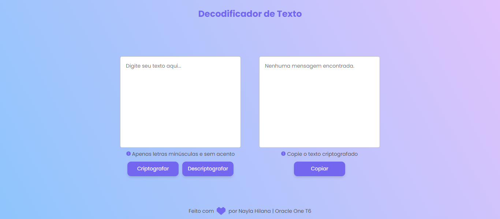

<h1 align=center> 💻 Decodificador de Texto - Formação Front-end Oracle One T6</h1>

> O decodificador permite criptografar e descriptograr textos e a criptografia funciona a partir da conversão de vogais.

#

